# Kafka

## 1 Kafka概述

### 1.1 定义

afka是一个分布式的基于发布/订阅模式的消息队列，主要应用于大数据实时处理领域。

### 1.2  消息队列（MessageQueue）

#### 1.2.1 传统消息队列的应用场景


#### 1.2.2 消息队列的两种模式

1.点对点模式（一对一，消费者主动拉取数据，消息收到后消息清除）

​	消息生产者生产消息发送到Queue中，然后消息消费者从Queue中取出并且消费消息。消息被消费以后，queue中不再有存储，所以消息消费者不可能消费到已经被消费的消息。Queue支持存在多个消费者，但是对一个消息而言，只会有一个消费者可以消费。

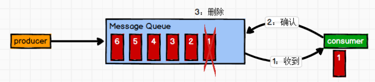

2.发布/订阅模式(一对多，消费者消费数据之后不会清除消息)

​		消息生产者（发布）将消息发布到topic中，同时有多个消息消费者（订阅）消费该消息。和点对点方式不同，发布到topic的消息会被所有订阅者消费。

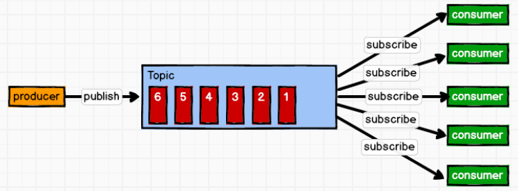

### 1.3 Kafka基础架构

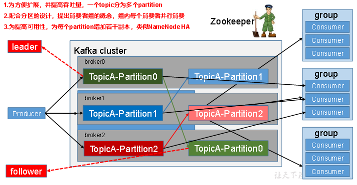

1）**Producer** ：消息生产者，就是向kafka broker发消息的客户端；

2）**Consumer** ：消息消费者，向kafka broker取消息的客户端；

3）**Consumer Group （CG**）：消费者组，由多个consumer组成。消费者组内每个消费者负责消费不同分区的数据，一个分区只能由一个消费者消费；消费者组之间互不影响。所有的消费者都属于某个消费者组，即消费者组是逻辑上的一个订阅者。

4）**Broker** ：一台kafka服务器就是一个broker。一个集群由多个broker组成。一个broker可以容纳多个topic。

5）**Topic** ：可以理解为一个队列，生产者和消费者面向的都是一个topic；

6）**Partition**：为了实现扩展性，一个非常大的topic可以分布到多个broker（即服务器）上，一个topic可以分为多个partition，每个partition是一个有序的队列；

7）**Replica**：副本，为保证集群中的某个节点发生故障时，该节点上的partition数据不丢失，且kafka仍然能够继续工作，kafka提供了副本机制，一个topic的每个分区都有若干个副本，一个leader\和若干个follower。

8）**leader**：每个分区多个副本的“主”，生产者发送数据的对象，以及消费者消费数据的对象都是leader。

9）**follower**：每个分区多个副本中的“从”，实时从leader中同步数据，保持和leader数据的同步。leader发生故障时，某个follower会成为新的follower。

## 2 Kafka快速入门

### 2.1 安装部署

#### 2.1.1 集群规划

| hadoop102 | hadoop103 | hadoop104 |
| --------- | --------- | --------- |
| zk        | zk        | zk        |
| kafka     | kafka     | kafka     |

#### 2.1.2 jar包下载

> http://kafka.apache.org/downloads.html

#### 2.1.3 集群部署

##### 1.解压安装包

```bash
[neuedu@hadoop102 software]$ tar -zxvf kafka_2.11-0.11.0.0.tgz -C /opt/module/
```

##### 2.修改解压后的文件名称

```bash
[neuedu@hadoop102 module]$ mv kafka_2.11-0.11.0.0/ kafka
```

##### 3.在/opt/module/kafka目录下创建logs文件夹

```bash
[neuedu@hadoop102 kafka]$ mkdir logs
```

##### 4.修改配置文件

```bash
[neuedu@hadoop102 kafka]$ cd config/
[neuedu@hadoop102 config]$ vi server.properties
```

输入以下内容：

```properties
#broker的全局唯一编号，不能重复
broker.id=0
#删除topic功能使能
delete.topic.enable=true
#处理网络请求的线程数量
num.network.threads=3
#用来处理磁盘IO的现成数量
num.io.threads=8
#发送套接字的缓冲区大小
socket.send.buffer.bytes=102400
#接收套接字的缓冲区大小
socket.receive.buffer.bytes=102400
#请求套接字的缓冲区大小
socket.request.max.bytes=104857600
#kafka运行日志存放的路径	
log.dirs=/opt/module/kafka/logs
#topic在当前broker上的分区个数
num.partitions=1
#用来恢复和清理data下数据的线程数量
num.recovery.threads.per.data.dir=1
#segment文件保留的最长时间，超时将被删除
log.retention.hours=168
#配置连接Zookeeper集群地址
zookeeper.connect=hadoop102:2181,hadoop103:2181,hadoop104:2181
```

##### 5.配置环境变量

```bash
[neuedu@hadoop102 module]$ sudo vi /etc/profile

#KAFKA_HOME
export KAFKA_HOME=/opt/module/kafka
export PATH=$PATH:$KAFKA_HOME/bin

[neuedu@hadoop102 module]$ source /etc/profile
```

##### 6.分发安装包

```bash
[neuedu@hadoop102 module]$ xsync kafka/
```

> 注意：分发之后记得配置其他机器的环境变量

##### 7.修改server.properties

分别在hadoop103和hadoop104上修改配置文件`/opt/module/kafka/config/server.properties`中的broker.id=1、broker.id=2

> 注：broker.id不得重复

##### 8.启动集群

依次在hadoop102、hadoop103、hadoop104节点上启动kafka

```bash
[neuedu@hadoop102 kafka]$ bin/kafka-server-start.sh -daemon config/server.properties
[neuedu@hadoop103 kafka]$ bin/kafka-server-start.sh -daemon  config/server.properties
[neuedu@hadoop104 kafka]$ bin/kafka-server-start.sh -daemon  config/server.properties
```

##### 9.关闭集群

```bash
[neuedu@hadoop102 kafka]$ bin/kafka-server-stop.sh stop
[neuedu@hadoop103 kafka]$ bin/kafka-server-stop.sh stop
[neuedu@hadoop104 kafka]$ bin/kafka-server-stop.sh stop
```

##### 10.kafka群起脚本

在/usr/local/bin 下创建群起脚本kstart

```bash
for i in `cat /opt/module/hadoop-2.7.2/etc/hadoop/slaves`
do
echo "========== $i ==========" 
ssh $i 'source /etc/profile&&/opt/module/kafka_2.11-0.11.0.2/bin/kafka-server-start.sh -daemon /opt/module/kafka_2.11-0.11.0.2/config/server.properties'
echo $?
done
```

设置可执行权限

```bash
[neuedu@hadoop102 kafka]$ sudo chmod +x kstart
```

### 2.2 Kafka命令行操作

1）查看当前服务器中的所有topic

```bash
[neuedu@hadoop102 kafka]$ bin/kafka-topics.sh --zookeeper hadoop102:2181 --list
```

2）创建topic

```bash
[neuedu@hadoop102 kafka]$ bin/kafka-topics.sh --zookeeper hadoop102:2181 \

--create --replication-factor 3 --partitions 1 --topic first
```

> 选项说明：
>
> --topic 定义topic名
>
> --replication-factor  定义副本数
>
> --partitions  定义分区数

3）删除topic

```bash
[neuedu@hadoop102 kafka]$ bin/kafka-topics.sh --zookeeper hadoop102:2181 \
--delete --topic first
```

>  需要server.properties中设置delete.topic.enable=true否则只是标记删除。

4）发送消息

```bash
[neuedu@hadoop102 kafka]$ bin/kafka-console-producer.sh \
--broker-list hadoop102:9092 --topic first=
\>hello world
\>neuedu  neuedu
```

5）消费消息

```bash
[neuedu@hadoop103 kafka]$ bin/kafka-console-consumer.sh \
--bootstrap-server hadoop102:9092 --from-beginning --topic first
[neuedu@hadoop103 kafka]$ bin/kafka-console-consumer.sh \
--bootstrap-server hadoop102:9092 --from-beginning --topic first
```

>  --from-beginning：会把主题中以往所有的数据都读取出来。

6）查看某个Topic的详情

```bash
[neuedu@hadoop102 kafka]$ bin/kafka-topics.sh --zookeeper hadoop102:2181 \
--describe --topic first
```

7）修改分区数

```bash
[neuedu@hadoop102 kafka]$bin/kafka-topics.sh --zookeeper hadoop102:2181 --alter --topic first --partitions 6
```

## 3 Kafka架构深入

###  3.1 Kafka工作流程及文件存储机制

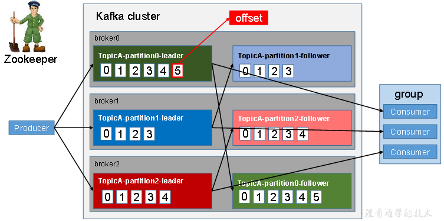

​	Kafka中消息是以**topic**进行分类的，生产者生产消息，消费者消费消息，都是面向topic的。

topic是逻辑上的概念，而partition是物理上的概念，每个partition对应于一个log文件，该log文件中存储的就是producer生产的数据。Producer生产的数据会被不断追加到该log文件末端，且每条数据都有自己的offset。消费者组中的每个消费者，都会实时记录自己消费到了哪个offset，以便出错恢复时，从上次的位置继续消费。

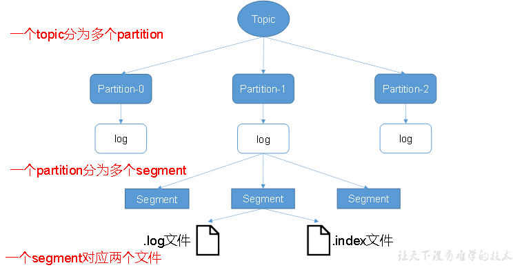

由于生产者生产的消息会不断追加到log文件末尾，为防止log文件过大导致数据定位效率低下，Kafka采取了**分片**和**索引**机制，将每个partition分为多个segment。每个segment对应两个文件——“.index”文件和“.log”文件。这些文件位于一个文件夹下，该文件夹的命名规则为：topic名称+分区序号。例如，first这个topic有三个分区，则其对应的文件夹为first-0,first-1,first-2。

```
00000000000000000000.index
00000000000000000000.log
00000000000000170410.index
00000000000000170410.log
00000000000000239430.index
00000000000000239430.log
```

index和log文件以当前segment的第一条消息的offset命名。下图为index文件和log文件的结构示意图。

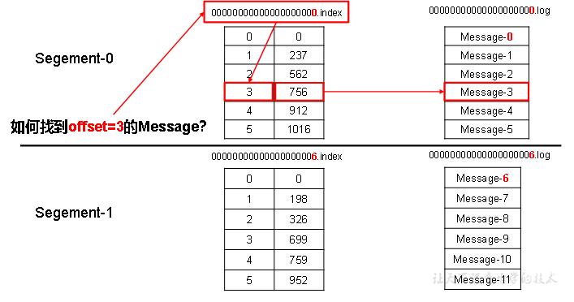

​	“.index”文件存储大量的索引信息，“.log”文件存储大量的数据，索引文件中的元数据指向对应数据文件中message的物理偏移地址。

### 3.2 Kafka生产者

#### 3.2.2 分区策略

##### 1.分区的原因

（1）**方便在集群中扩展**，每个Partition可以通过调整以适应它所在的机器，而一个topic又可以有多个Partition组成，因此整个集群就可以适应任意大小的数据了；

（2）**可以提高并发**，因为可以以Partition为单位读写了。

##### 2.分区的原则

我们需要将producer发送的数据封装成一个`ProducerRecord`对象。

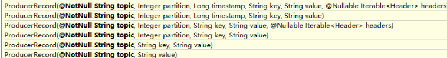

（1）指明 partition 的情况下，直接将指明的值直接作为 partiton 值；

（2）没有指明 partition 值但有 key 的情况下，将 key 的 hash 值与 topic 的 partition 数进行取余得到 partition 值；

（3）既没有 partition 值又没有 key 值的情况下，第一次调用时随机生成一个整数（后面每次调用在这个整数上自增），将这个值与 topic 可用的 partition 总数取余得到 partition 值，也就是常说的 round-robin 算法。

#### 3.2.3 数据可靠性保证

​		为保证producer发送的数据，能可靠的发送到指定的topic，topic的每个partition收到producer发送的数据后，都需要向producer发送ack（acknowledgement确认收到），如果producer收到ack，就会进行下一轮的发送，否则重新发送数据。

	

##### 1.副本数据同步策略

| 方案                        | 优点                                               | 缺点                                                |
| --------------------------- | -------------------------------------------------- | --------------------------------------------------- |
| 半数以上完成同步，就发送ack | 延迟低                                             | 选举新的leader时，容忍n台节点的故障，需要2n+1个副本 |
| 全部完成同步，才发送ack     | 选举新的leader时，容忍n台节点的故障，需要n+1个副本 | 延迟高                                              |

Kafka选择了第二种方案，原因如下：

1.同样为了容忍n台节点的故障，第一种方案需要2n+1个副本，而第二种方案只需要n+1个副本，而Kafka的每个分区都有大量的数据，第一种方案会造成大量数据的冗余。

2.虽然第二种方案的网络延迟会比较高，但网络延迟对Kafka的影响较小。

###### 2）ISR

​	采用第二种方案之后，设想以下情景：leader收到数据，所有follower都开始同步数据，但有一个follower，因为某种故障，迟迟不能与leader进行同步，那leader就要一直等下去，直到它完成同步，才能发送ack。这个问题怎么解决呢？

​	Leader维护了一个动态的in-sync replica set (ISR)，意为和leader保持同步的follower集合。当ISR中的follower完成数据的同步之后，leader就会给follower发送ack。如果follower长时间未向leader同步数据，则该follower将被踢出ISR，该时间阈值`replica.lag.time.max.ms`参数设定。Leader发生故障之后，就会从ISR中选举新的leader。

###### 3）ack应答机制

对于某些不太重要的数据，对数据的可靠性要求不是很高，能够容忍数据的少量丢失，所以没必要等ISR中的follower全部接收成功。

所以Kafka为用户提供了三种可靠性级别，用户根据对可靠性和延迟的要求进行权衡，选择以下的配置。

acks参数配置：

acks：

0：producer不等待broker的ack，这一操作提供了一个最低的延迟，broker一接收到还没有写入磁盘就已经返回，当broker故障时有可能丢失数据；

1：producer等待broker的ack，partition的leader落盘成功后返回ack，如果在follower同步成功之前leader故障，那么将会丢失数据；

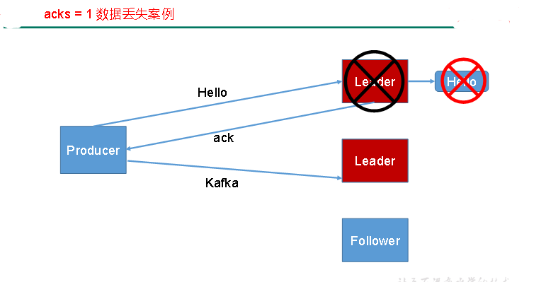

-1（all）：producer等待broker的ack，partition的leader和follower全部落盘成功后才返回ack。但是如果在follower同步完成后，broker发送ack之前，leader发生故障，那么会造成**数据重复**。

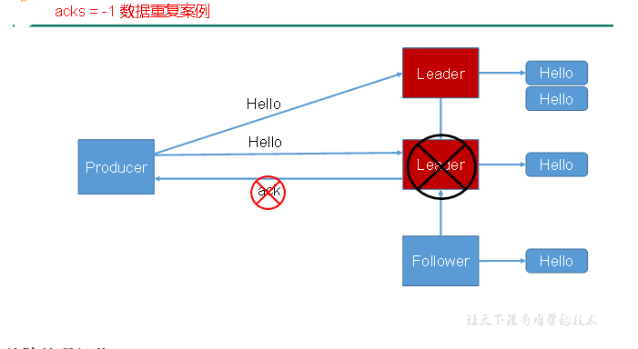

###### 4) 故障处理细节

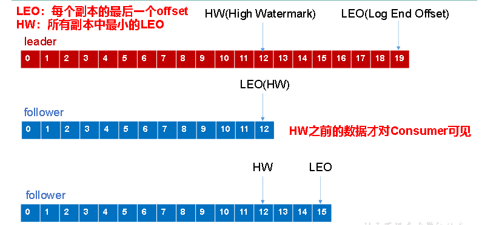

（1）**follower故障**

follower发生故障后会被临时踢出ISR，待该follower恢复后，follower会读取本地磁盘记录的上次的HW，并将log文件高于HW的部分截取掉，从HW开始向leader进行同步。等该follower的LEO大于等于该Partition的HW，即follower追上leader之后，就可以重新加入ISR了。

（2）**leader故障**

leader发生故障之后，会从ISR中选出一个新的leader，之后，为保证多个副本之间的数据一致性，其余的follower会先将各自的log文件高于HW的部分截掉，然后从新的leader同步数据。

>  注意：这只能保证副本之间的数据一致性，并不能保证数据不丢失或者不重复。

#### 3.2.4 Exactly Once语义

​		对于某些比较重要的消息，我们需要保证exactly once语义，即**保证每条消息被发送且仅被发送一次**。

​		在0.11版本之后，Kafka引入了幂等性机制（idempotent），配合acks = -1时的at least once语义，实现了producer到broker的exactly once语义。

```bash
idempotent + at least once = exactly once
```

使用时，只需将enable.idempotence属性设置为true，kafka自动将acks属性设为-1。

### 3.3 Kafka消费者

#### 3.3.1 消费方式

​	**consumer采用pull（拉）模式从broker中读取数据**。

​	**push（推）模式很难适应消费速率不同的消费者，因为消息发送速率是由broker决定的。**它的目标是尽可能以最快速度传递消息，但是这样很容易造成consumer来不及处理消息，典型的表现就是拒绝服务以及网络拥塞。而pull模式则可以根据consumer的消费能力以适当的速率消费消息。

​	**pull模式不足之处是，如果kafka没有数据，消费者可能会陷入循环中，一直返回空数据。**针对这一点，Kafka的消费者在消费数据时会传入一个时长参数timeout，如果当前没有数据可供消费，consumer会等待一段时间之后再返回，这段时长即为timeout。

#### 3.3.2 分区分配策略

​	一个consumer group中有多个consumer，一个 topic有多个partition，所以必然会涉及到partition的分配问题，即确定那个partition由哪个consumer来消费。

​	Kafka有两种分配策略，一是roundrobin，一是range。

##### 1. roundrobin

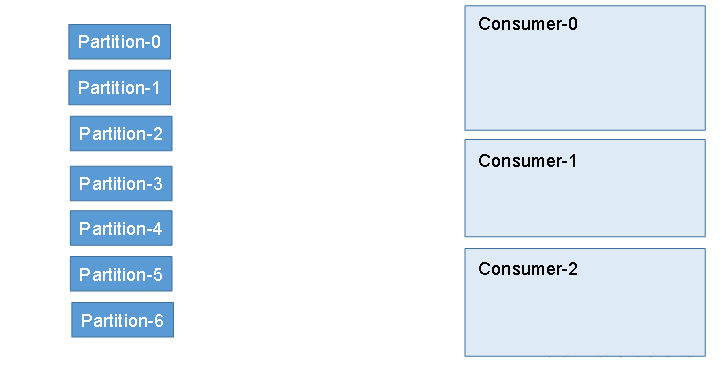

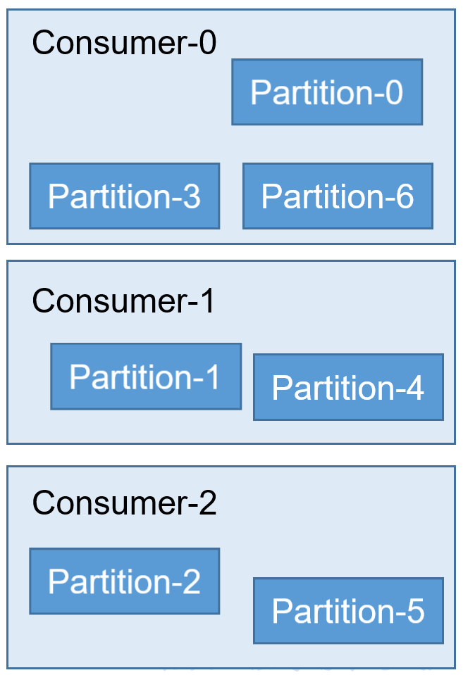

##### 2.range

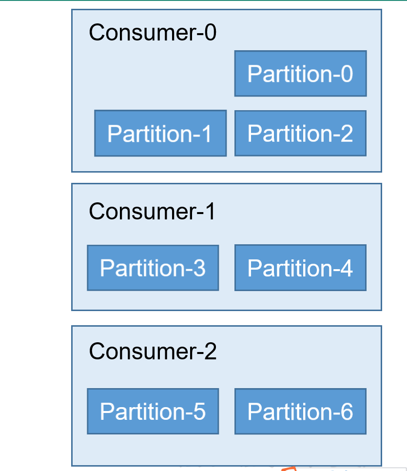

#### 3.3.4 offset的维护

​	由于consumer在消费过程中可能会出现断电宕机等故障，consumer恢复后，需要从故障前的位置的继续消费，所以consumer需要实时记录自己消费到了哪个offset，以便故障恢复后继续消费。

​	**Kafka 0.9版本之前，consumer默认将offset保存在Zookeeper中，从0.9版本开始，consumer默认将offset保存在Kafka一个内置的topic中，该topic为__consumer_offsets。**

### 3.4 Kafka 高效读写数据

#### 1.顺序写磁盘

​	Kafka的producer生产数据，要写入到log文件中，写的过程是一直追加到文件末端，为顺序写。官网有数据表明，同样的磁盘，顺序写能到到600M/s，而随机写只有100k/s。这与磁盘的机械机构有关，顺序写之所以快，是因为其省去了大量磁头寻址的时间。

#### 2.零复制技术

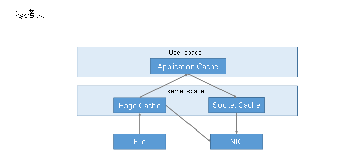

### 3.5 Zookeeper在Kafka中的作用

​	Kafka集群中有一个broker会被选举为Controller，**负责管理集群broker的上下线**，所有topic的**分区副本分配**和**leader选举**等工作。

​	Controller的管理工作都是依赖于Zookeeper的。

​	以下为partition的leader选举过程：

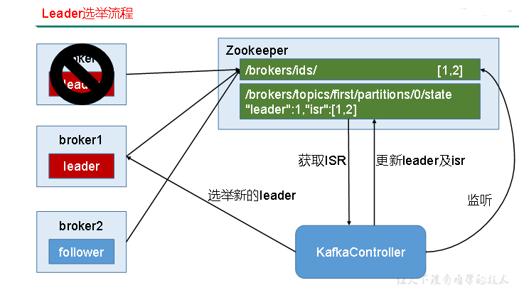

## 4.Kafka API

### 4.1 Producer API

#### 4.1.1 消息发送流程

Kafka的Producer发送消息采用的是***异步发送*****的方式。在消息发送的过程中，涉及到了*两个线程——main线程和Sender线程*，**以及一个线程共享变量——**RecordAccumulator**。main线程将消息发送给**RecordAccumulator**，**Sender**线程不断从**RecordAccumulator**中拉取消息发送到Kafka broker。

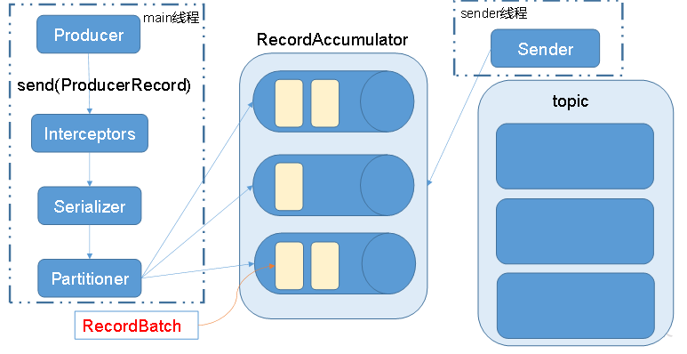

相关参数：

**batch.size**：只有数据积累到batch.size之后，sender才会发送数据。

**linger.ms**：如果数据迟迟未达到batch.size，sender等待linger.time之后就会发送数据。

#### 4.1.2 异步发送API

1）**导入依赖**

```xml
<dependency>
    <groupId>org.apache.kafka</groupId>
    <artifactId>kafka-clients</artifactId>
    <version>0.11.0.0</version>
</dependency>
```

2）编写代码

需要用到的类：

**KafkaProducer**：需要创建一个生产者对象，用来发送数据

**ProducerConfig**：获取所需的一系列配置参数

**ProducerRecord**：每条数据都要封装成一个**ProducerRecord**对象

##### 1.不带回调函数的API

```java
package com.neuedu.kafka;

import org.apache.kafka.clients.producer.*;

import java.util.Properties;
import java.util.concurrent.ExecutionException;

public class CustomProducer {

    public static void main(String[] args) throws ExecutionException, InterruptedException {
        Properties props = new Properties();
        props.put("bootstrap.servers", "hadoop102:9092");//kafka集群，broker-list
        props.put("acks", "all");
        props.put("retries", 1);//重试次数
        props.put("batch.size", 16384);//批次大小
        props.put("linger.ms", 1);//等待时间
        props.put("buffer.memory", 33554432);//RecordAccumulator缓冲区大小
        props.put("key.serializer", "org.apache.kafka.common.serialization.StringSerializer");
        props.put("value.serializer", "org.apache.kafka.common.serialization.StringSerializer");

        Producer<String, String> producer = new KafkaProducer<>(props);
        for (int i = 0; i < 100; i++) {
            producer.send(new ProducerRecord<String, String>("first", Integer.toString(i), Integer.toString(i)));
        }
        producer.close();
    }
}
```

##### 2.带回调函数的API

​	回调函数会在producer收到ack时调用，为异步调用，该方法有两个参数，分别是RecordMetadata和Exception，如果Exception为null，说明消息发送成功，如果Exception不为null，说明消息发送失败。

>  注意：消息发送失败会自动重试，不需要我们在回调函数中手动重试。

```java
package com.neuedu.kafka;

import org.apache.kafka.clients.producer.*;

import java.util.Properties;
import java.util.concurrent.ExecutionException;

public class CustomProducer {

    public static void main(String[] args) throws ExecutionException, InterruptedException {
        Properties props = new Properties();
        props.put("bootstrap.servers", "hadoop102:9092");//kafka集群，broker-list
        props.put("acks", "all");
        props.put("retries", 1);//重试次数
        props.put("batch.size", 16384);//批次大小
        props.put("linger.ms", 1);//等待时间
        props.put("buffer.memory", 33554432);//RecordAccumulator缓冲区大小
        props.put("key.serializer", "org.apache.kafka.common.serialization.StringSerializer");
        props.put("value.serializer", "org.apache.kafka.common.serialization.StringSerializer");

        Producer<String, String> producer = new KafkaProducer<>(props);
        for (int i = 0; i < 100; i++) {
            producer.send(new ProducerRecord<String, String>("first", Integer.toString(i), Integer.toString(i)), new Callback() {

                //回调函数，该方法会在Producer收到ack时调用，为异步调用
                @Override
                public void onCompletion(RecordMetadata metadata, Exception exception) {
                    if (exception == null) {
                        System.out.println("success->" + metadata.offset());
                    } else {
                        exception.printStackTrace();
                    }
                }
            });
        }
        producer.close();
    }
}
```

#### 4.1.3 同步发送API

​	同步发送的意思就是，一条消息发送之后，会阻塞当前线程，直至返回ack。

由于send方法返回的是一个Future对象，根据Futrue对象的特点，我们也可以实现同步发送的效果，只需在调用Future对象的get方发即可。

```java
package com.neuedu.kafka;

import org.apache.kafka.clients.producer.KafkaProducer;
import org.apache.kafka.clients.producer.Producer;
import org.apache.kafka.clients.producer.ProducerRecord;

import java.util.Properties;
import java.util.concurrent.ExecutionException;

public class CustomProducer {

    public static void main(String[] args) throws ExecutionException, InterruptedException {
        Properties props = new Properties();
        props.put("bootstrap.servers", "hadoop102:9092");//kafka集群，broker-list
        props.put("acks", "all");
        props.put("retries", 1);//重试次数
        props.put("batch.size", 16384);//批次大小
        props.put("linger.ms", 1);//等待时间
        props.put("buffer.memory", 33554432);//RecordAccumulator缓冲区大小
        props.put("key.serializer", "org.apache.kafka.common.serialization.StringSerializer");
        props.put("value.serializer", "org.apache.kafka.common.serialization.StringSerializer");

        Producer<String, String> producer = new KafkaProducer<>(props);
        for (int i = 0; i < 100; i++) {
            producer.send(new ProducerRecord<String, String>("first", Integer.toString(i), Integer.toString(i))).get();
        }
        producer.close();
    }
}

```

### 4.2 Consumer API

​	Consumer消费数据时的可靠性是很容易保证的，因为数据在Kafka中是持久化的，故不用担心数据丢失问题。

​	由于consumer在消费过程中可能会出现断电宕机等故障，consumer恢复后，需要从故障前的位置的继续消费，所以consumer需要实时记录自己消费到了哪个offset，以便故障恢复后继续消费。

​	所以offset的维护是Consumer消费数据是必须考虑的问题。

#### 4.2.1 手动提交offset

1). 导入依赖

```xml
<dependency>
    <groupId>org.apache.kafka</groupId>
    <artifactId>kafka-clients</artifactId>
    <version>0.11.0.0</version>
</dependency>
```

2).编写代码

需要用到的类：

**KafkaConsumer**：需要创建一个消费者对象，用来消费数据

**ConsumerConfig**：获取所需的一系列配置参数

**ConsuemrRecord**：每条数据都要封装成一个ConsumerRecord对象

```java
package com.neuedu.kafka;

import org.apache.kafka.clients.consumer.ConsumerRecord;
import org.apache.kafka.clients.consumer.ConsumerRecords;
import org.apache.kafka.clients.consumer.KafkaConsumer;

import java.util.Arrays;
import java.util.Properties;

public class CustomConsumer {

    public static void main(String[] args) {
        Properties props = new Properties();
        props.put("bootstrap.servers", "hadoop102:9092");
        props.put("group.id", "test");//消费者组，只要group.id相同，就属于同一个消费者组
        props.put("enable.auto.commit", "false");//自动提交offset
       
        props.put("key.deserializer", "org.apache.kafka.common.serialization.StringDeserializer");
        props.put("value.deserializer", "org.apache.kafka.common.serialization.StringDeserializer");
        KafkaConsumer<String, String> consumer = new KafkaConsumer<>(props);
        consumer.subscribe(Arrays.asList("first"));
        while (true) {
            ConsumerRecords<String, String> records = consumer.poll(100);
            for (ConsumerRecord<String, String> record : records) {
                System.out.printf("offset = %d, key = %s, value = %s%n", record.offset(), record.key(), record.value());
            }
            consumer.commitSync();
        }
    }
}
```

3）代码分析：

手动提交offset的方法有两种：分别是commitSync（同步提交）和commitAsync（异步提交）。两者的相同点是，都会将本次**poll的一批数据最高的偏移量提交**；不同点是，commitSync会失败重试，一直到提交成功（如果由于不可恢复原因导致，也会提交失败）；而commitAsync则没有失败重试机制，故有可能提交失败。

4）数据重复消费问题

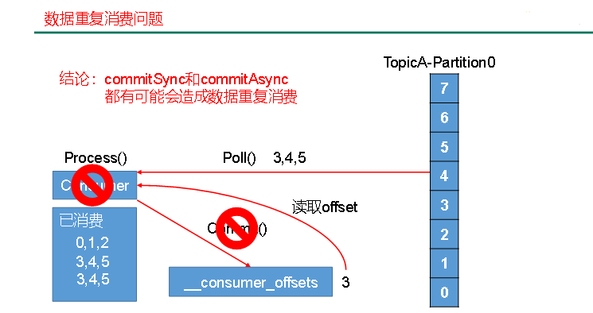

#### 4.2.2 自动提交offset

为了使我们能够专注于自己的业务逻辑，Kafka提供了自动提交offset的功能。 

自动提交offset的相关参数：

`enable.auto.commit`：是否开启自动提交offset功能

`auto.commit.interval.ms`：自动提交offset的时间间隔

以下为自动提交offset的代码：

```java
package com.neuedu.kafka;

import org.apache.kafka.clients.consumer.ConsumerRecord;
import org.apache.kafka.clients.consumer.ConsumerRecords;
import org.apache.kafka.clients.consumer.KafkaConsumer;

import java.util.Arrays;
import java.util.Properties;

public class CustomConsumer {

    public static void main(String[] args) {
        Properties props = new Properties();
        props.put("bootstrap.servers", "hadoop102:9092");
        props.put("group.id", "test");
        props.put("enable.auto.commit", "true");
        props.put("auto.commit.interval.ms", "1000");
        props.put("key.deserializer", "org.apache.kafka.common.serialization.StringDeserializer");
        props.put("value.deserializer", "org.apache.kafka.common.serialization.StringDeserializer");
        KafkaConsumer<String, String> consumer = new KafkaConsumer<>(props);
        consumer.subscribe(Arrays.asList("first"));
        while (true) {
            ConsumerRecords<String, String> records = consumer.poll(100);
            for (ConsumerRecord<String, String> record : records)
                System.out.printf("offset = %d, key = %s, value = %s%n", record.offset(), record.key(), record.value());
        }
    }
}
```

### 4.3 自定义Interceptor

#### 4.3.1 拦截器原理

Producer拦截器(interceptor)是在Kafka 0.10版本被引入的，主要用于实现clients端的定制化控制逻辑。

对于producer而言，interceptor使得用户在消息发送前以及producer回调逻辑前有机会对消息做一些定制化需求，比如修改消息等。同时，producer允许用户指定多个interceptor按序作用于同一条消息从而形成一个拦截链(interceptor chain)。Intercetpor的实现接口是`org.apache.kafka.clients.producer.ProducerInterceptor`，其定义的方法包括：

（1）`configure(configs)`

获取配置信息和初始化数据时调用。

（2）`onSend(ProducerRecord)`：

该方法封装进`KafkaProducer.send`方法中，即它运行在用户主线程中。Producer确保在消息被序列化以及计算分区前调用该方法。用户可以在该方法中对消息做任何操作，但最好保证不要修改消息所属的topic和分区，否则会影响目标分区的计算。

（3）`onAcknowledgement(RecordMetadata, Exception)`：

该方法会在消息从`RecordAccumulator`成功发送到Kafka Broker之后，或者在发送过程中失败时调用。并且通常都是在producer回调逻辑触发之前。`onAcknowledgement`运行在producer的IO线程中，因此不要在该方法中放入很重的逻辑，否则会拖慢producer的消息发送效率。

（4）`close`：

关闭interceptor，主要用于执行一些资源清理工作

如前所述，interceptor可能被运行在多个线程中，因此在具体实现时用户需要自行确保线程安全。另外倘若指定了多个interceptor，则producer将按照指定顺序调用它们，并仅仅是捕获每个interceptor可能抛出的异常记录到错误日志中而非在向上传递。这在使用过程中要特别留意。

#### 4.2.3 拦截器案例

1）需求：

​	实现一个简单的双interceptor组成的拦截链。第一个interceptor会在消息发送前将时间戳信息加到消息value的最前部；第二个interceptor会在消息发送后更新成功发送消息数或失败发送消息数。

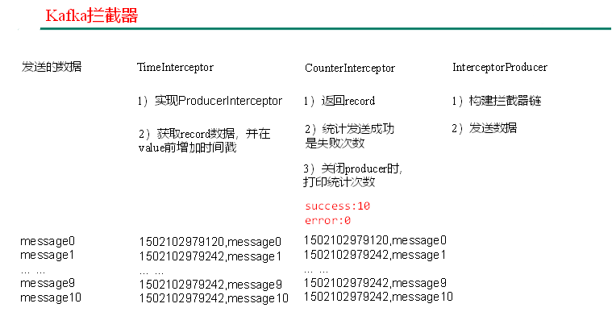

2）案例实操

（1）增加时间戳拦截器

```java
package com.neuedu.kafka.interceptor;
import java.util.Map;
import org.apache.kafka.clients.producer.ProducerInterceptor;
import org.apache.kafka.clients.producer.ProducerRecord;
import org.apache.kafka.clients.producer.RecordMetadata;

public class TimeInterceptor implements ProducerInterceptor<String, String> {

	@Override
	public void configure(Map<String, ?> configs) {

	}

	@Override
	public ProducerRecord<String, String> onSend(ProducerRecord<String, String> record) {
		// 创建一个新的record，把时间戳写入消息体的最前部
		return new ProducerRecord(record.topic(), record.partition(), record.timestamp(), record.key(),
				System.currentTimeMillis() + "," + record.value().toString());
	}

	@Override
	public void onAcknowledgement(RecordMetadata metadata, Exception exception) {

	}

	@Override
	public void close() {

	}
}
```

（2）统计发送消息成功和发送失败消息数，并在producer关闭时打印这两个计数器

```java
package com.neuedu.kafka.interceptor;
import java.util.Map;
import org.apache.kafka.clients.producer.ProducerInterceptor;
import org.apache.kafka.clients.producer.ProducerRecord;
import org.apache.kafka.clients.producer.RecordMetadata;

public class CounterInterceptor implements ProducerInterceptor<String, String>{
    private int errorCounter = 0;
    private int successCounter = 0;

	@Override
	public void configure(Map<String, ?> configs) {
		
	}

	@Override
	public ProducerRecord<String, String> onSend(ProducerRecord<String, String> record) {
		 return record;
	}

	@Override
	public void onAcknowledgement(RecordMetadata metadata, Exception exception) {
		// 统计成功和失败的次数
        if (exception == null) {
            successCounter++;
        } else {
            errorCounter++;
        }
	}

	@Override
	public void close() {
        // 保存结果
        System.out.println("Successful sent: " + successCounter);
        System.out.println("Failed sent: " + errorCounter);
	}
}
```

（3）producer主程序

```java
import java.util.Properties;
import org.apache.kafka.clients.producer.KafkaProducer;
import org.apache.kafka.clients.producer.Producer;
import org.apache.kafka.clients.producer.ProducerConfig;
import org.apache.kafka.clients.producer.ProducerRecord;

public class InterceptorProducer {

	public static void main(String[] args) throws Exception {
		// 1 设置配置信息
		Properties props = new Properties();
		props.put("bootstrap.servers", "hadoop102:9092");
		props.put("acks", "all");
		props.put("retries", 0);
		props.put("batch.size", 16384);
		props.put("linger.ms", 1);
		props.put("buffer.memory", 33554432);
		props.put("key.serializer", "org.apache.kafka.common.serialization.StringSerializer");
		props.put("value.serializer", "org.apache.kafka.common.serialization.StringSerializer");
		
		// 2 构建拦截链
		List<String> interceptors = new ArrayList<>();
		interceptors.add("com.neuedu.kafka.interceptor.TimeInterceptor"); 	interceptors.add("com.neuedu.kafka.interceptor.CounterInterceptor"); 
		props.put(ProducerConfig.INTERCEPTOR_CLASSES_CONFIG, interceptors);
		 
		String topic = "first";
		Producer<String, String> producer = new KafkaProducer<>(props);
		
		// 3 发送消息
		for (int i = 0; i < 10; i++) {
			
		    ProducerRecord<String, String> record = new ProducerRecord<>(topic, "message" + i);
		    producer.send(record);
		}
		 
		// 4 一定要关闭producer，这样才会调用interceptor的close方法
		producer.close();
	}
}
```

3）测试

（1）在kafka上启动消费者，然后运行客户端java程序。

```bash
[neuedu@hadoop102 kafka]$ bin/kafka-console-consumer.sh \
--bootstrap-server hadoop102:9092 --from-beginning --topic first

1501904047034,message0
1501904047225,message1
1501904047230,message2
1501904047234,message3
1501904047236,message4
1501904047240,message5
1501904047243,message6
1501904047246,message7
1501904047249,message8
1501904047252,message9
```

## 5 Flume对接Kafka

### 1. 配置flume(flume-kafka.conf)

```properties
# define
a1.sources = r1
a1.sinks = k1
a1.channels = c1

# source
a1.sources.r1.type = exec
a1.sources.r1.command = tail -F -c +0 /opt/module/datas/flume.log
a1.sources.r1.shell = /bin/bash -c

# sink
a1.sinks.k1.type = org.apache.flume.sink.kafka.KafkaSink
a1.sinks.k1.kafka.bootstrap.servers = hadoop102:9092,hadoop103:9092,hadoop104:9092
a1.sinks.k1.kafka.topic = first
a1.sinks.k1.kafka.flumeBatchSize = 20
a1.sinks.k1.kafka.producer.acks = 1
a1.sinks.k1.kafka.producer.linger.ms = 1

# channel
a1.channels.c1.type = memory
a1.channels.c1.capacity = 1000
a1.channels.c1.transactionCapacity = 100

# bind
a1.sources.r1.channels = c1
a1.sinks.k1.channel = c1
```

### 2 启动kafkaIDEA消费者

### 3 进入flume根目录下，启动flume

```bash
$ bin/flume-ng agent -c conf/ -n a1 -f jobs/flume-kafka.conf
```

### 4 向`/opt/module/datas/flume.log`里追加数据，查看kafka消费者消费情况

```bash
$ echo hello >> /opt/module/datas/flume.log
```

## 6 Kafka监控

### 6.1 KafkaMonitor

1.上传jar包`KafkaOffsetMonitor-assembly-0.4.6.jar`到集群

2.在`/opt/module/`下创建`kafka-offset-console`文件夹

3.将上传的jar包放入刚创建的目录下

4.在`/opt/module/kafka-offset-console`目录下创建启动脚本`start.sh`，内容如下：

```bash
#!/bin/bash
java -cp KafkaOffsetMonitor-assembly-0.4.6-SNAPSHOT.jar \
com.quantifind.kafka.offsetapp.OffsetGetterWeb \
--offsetStorage kafka \
--kafkaBrokers hadoop102:9092,hadoop103:9092,hadoop104:9092 \
--kafkaSecurityProtocol PLAINTEXT \
--zk hadoop102:2181,hadoop103:2181,hadoop104:2181 \
--port 8086 \
--refresh 10.seconds \
--retain 2.days \
--dbName offsetapp_kafka &
```

5.在`/opt/module/kafka-offset-console`目录下创建mobile-logs文件夹

```bash
mkdir /opt/module/kafka-offset-console/mobile-logs
```

6.启动KafkaMonitor

```bash
sudo chomod +x start.sh
./start.sh
```

7.登录页面hadoop102:8086端口查看详情

### 6.2 Kafka Manager

1.上传压缩包`kafka-manager-1.3.3.15.zip`到集群

2.解压到`/opt/module`

3.修改配置文件`conf/application.conf`

```bash
kafka-manager.zkhosts="kafka-manager-zookeeper:2181"
```

修改为：

```bash
kafka-manager.zkhosts="hadoop102:2181,hadoop103:2181,hadoop104:2181"
```

4.启动kafka-manager

```bash
bin/kafka-manager
```

5.登录hadoop102:9000页面查看详细信息