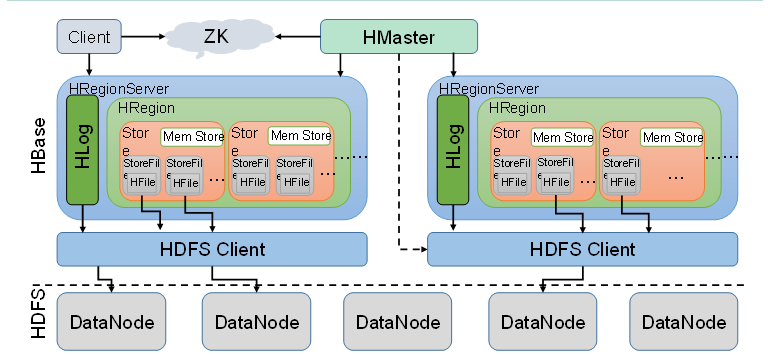
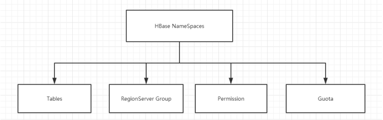
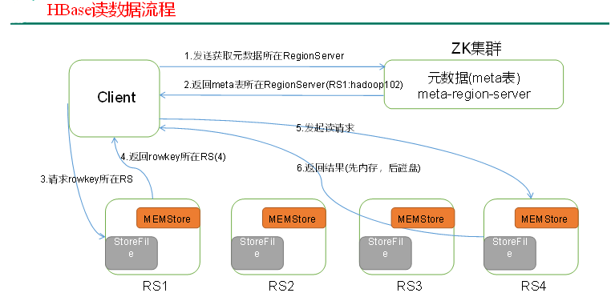
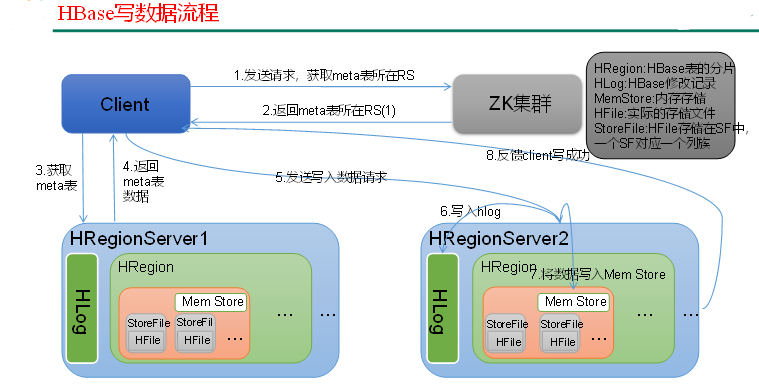
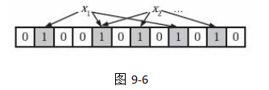
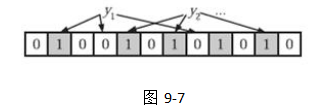

# 大数据技术之HBase

## 1 HBase简介

### 1.1 什么是HBase

​	HBase的原型是Google的BigTable论文，受到了该论文思想的启发，目前作为Hadoop的子项目来开发维护，用于支持结构化的数据存储。

​	官方网站：http://hbase.apache.org

​	-- 2006年Google发表BigTable白皮书

​	-- 2006年开始开发HBase

​	-- 2008年北京成功开奥运会，程序员默默地将HBase弄成了Hadoop的子项目

​	-- 2010年HBase成为Apache顶级项目

​	-- 现在很多公司二次开发出了很多发行版本，你也开始使用了。

​	HBase是一个高可靠性、高性能、面向列、可伸缩的分布式存储系统，利用HBASE技术可在廉价PC Server上搭建起大规模结构化存储集群。

​	HBase的目标是存储并处理大型的数据，更具体来说是仅需使用普通的硬件配置，就能够处理由成千上万的行和列所组成的大型数据。

​	HBase是Google Bigtable的开源实现，但是也有很多不同之处。比如：Google Bigtable利用GFS作为其文件存储系统，HBase利用Hadoop HDFS作为其文件存储系统；Google运行MAPREDUCE来处理Bigtable中的海量数据，HBase同样利用Hadoop MapReduce来处理HBase中的海量数据；Google Bigtable利用Chubby作为协同服务，HBase利用Zookeeper作为对应。

### 1.2 Hbase特点

#### 1 海量存储

Hbase适合存储PB级别的海量数据，在PB级别的数据以及采用廉价PC存储的情况下，能在几十到百毫秒内返回数据。这与Hbase的极易扩展性息息相关。正式因为Hbase良好的扩展性，才为海量数据的存储提供了便利。

#### 2 列式存储

这里的列式存储其实说的是列族（ColumnFamily）存储，Hbase是根据列族来存储数据的。列族下面可以有非常多的列，列族在创建表的时候就必须指定。

#### 3 极易扩展

Hbase的扩展性主要体现在两个方面，一个是基于上层处理能力（RegionServer）的扩展，一个是基于存储的扩展（HDFS）。
通过横向添加RegionSever的机器，进行水平扩展，提升Hbase上层的处理能力，提升Hbsae服务更多Region的能力。

备注：RegionServer的作用是管理region、承接业务的访问，这个后面会详细的介绍通过横向添加Datanode的机器，进行存储层扩容，提升Hbase的数据存储能力和提升后端存储的读写能力。

#### 4 高并发（多核）

由于目前大部分使用Hbase的架构，都是采用的廉价PC，因此单个IO的延迟其实并不小，一般在几十到上百ms之间。这里说的高并发，主要是在并发的情况下，Hbase的单个IO延迟下降并不多。能获得高并发、低延迟的服务。

#### 5 稀疏

稀疏主要是针对Hbase列的灵活性，在列族中，你可以指定任意多的列，在列数据为空的情况下，是不会占用存储空间的。

### 1.3 HBase架构

Hbase架构如图1所示：



从图中可以看出Hbase是由Client、Zookeeper、Master、HRegionServer、HDFS等几个组件组成，下面来介绍一下几个组件的相关功能：

1）Client

Client包含了访问Hbase的接口，另外Client还维护了对应的cache来加速Hbase的访问，比如cache的.META.元数据的信息。

2）Zookeeper

HBase通过Zookeeper来做master的高可用、RegionServer的监控、元数据的入口以及集群配置的维护等工作。具体工作如下：

通过Zoopkeeper来保证集群中只有1个master在运行，如果master异常，会通过竞争机制产生新的master提供服务

通过Zoopkeeper来监控RegionServer的状态，当RegionSevrer有异常的时候，通过回调的形式通知Master RegionServer上下线的信息

通过Zoopkeeper存储元数据的统一入口地址

3）Hmaster（NameNode）

master节点的主要职责如下：
为RegionServer分配Region
维护整个集群的负载均衡
维护集群的元数据信息
发现失效的Region，并将失效的Region分配到正常的RegionServer上
当RegionSever失效的时候，协调对应Hlog的拆分

4）HregionServer(DataNode)

HregionServer直接对接用户的读写请求，是真正的“干活”的节点。它的功能概括如下：
管理master为其分配的Region
处理来自客户端的读写请求
负责和底层HDFS的交互，存储数据到HDFS
负责Region变大以后的拆分
负责Storefile的合并工作

5）HDFS

HDFS为Hbase提供最终的底层数据存储服务，同时为HBase提供高可用（Hlog存储在HDFS）的支持，具体功能概括如下：
提供元数据和表数据的底层分布式存储服务
数据多副本，保证的高可靠和高可用性

### 1.4 HBase中的角色

#### 1.4.1 Hmaster

功能

1．监控RegionServer

2．处理RegionServer故障转移

3．处理元数据的变更

4．处理region的分配或转移

5．在空闲时间进行数据的负载均衡

6．通过Zookeeper发布自己的位置给客户端

#### 1.4.2 RegionServer

功能

1．负责存储HBase的实际数据

2．处理分配给它的Region

3．刷新缓存到HDFS

4．维护Hlog

5．执行压缩

6．负责处理Region分片

#### 1.4.3 其他组件

##### 1．Write-Ahead logs

HBase的修改记录，当对HBase读写数据的时候，数据不是直接写进磁盘，它会在内存中保留一段时间（时间以及数据量阈值可以设定）。但把数据保存在内存中可能有更高的概率引起数据丢失，为了解决这个问题，数据会先写在一个叫做Write-Ahead logfile的文件中，然后再写入内存中。所以在系统出现故障的时候，数据可以通过这个日志文件重建。

##### 2．Region

Hbase表的分片，HBase表会根据RowKey值被切分成不同的region存储在RegionServer中，在一个RegionServer中可以有多个不同的region。

##### 3．Store

HFile存储在Store中，一个Store对应HBase表中的一个列族(列簇， Column Family)。

##### 4．MemStore

顾名思义，就是内存存储，位于内存中，用来保存当前的数据操作，所以当数据保存在WAL中之后，RegsionServer会在内存中存储键值对。

##### 5．HFile

这是在磁盘上保存原始数据的实际的物理文件，是实际的存储文件。StoreFile是以Hfile的形式存储在HDFS的。

## 2 HBase安装

### 2.1 Zookeeper正常部署

首先保证Zookeeper集群的正常部署，并启动之：

```bash
[neuedu@hadoop102 zookeeper-3.4.10]$ bin/zkServer.sh start
[neuedu@hadoop103 zookeeper-3.4.10]$ bin/zkServer.sh start
[neuedu@hadoop104 zookeeper-3.4.10]$ bin/zkServer.sh start
```

### 2.2 Hadoop正常部署

Hadoop集群的正常部署并启动：

```bash
[neuedu@hadoop102 hadoop-2.7.2]$ sbin/start-dfs.sh
[neuedu@hadoop103 hadoop-2.7.2]$ sbin/start-yarn.sh
```

### 2.3 HBase的解压

解压HBase到指定目录：

```bash
[neuedu@hadoop102 software]$ tar -zxvf hbase-1.3.1-bin.tar.gz -C /opt/module
```

### 2.4 HBase的配置文件

修改HBase对应的配置文件。

1）hbase-env.sh修改内容：

```sh
export JAVA_HOME=/opt/module/jdk1.8.0_144
export HBASE_MANAGES_ZK=false
JDK1.8需要注释
#export HBASE_MASTER_OPTS。。。。
#export HBASE_REGIONSERVER_OPTS。。。
```

2）hbase-site.xml修改内容：

```xml
<configuration>
	<property>     
		<name>hbase.rootdir</name>     
		<value>hdfs://hadoop102:9000/hbase</value>   
	</property>

	<property>   
		<name>hbase.cluster.distributed</name>
		<value>true</value>
	</property>

   <!-- 0.98后的新变动，之前版本没有.port,默认端口为60000 -->
	<property>
		<name>hbase.master.port</name>
		<value>16000</value>
	</property>

	<property>   
		<name>hbase.zookeeper.quorum</name>
	     <value>hadoop102:2181,hadoop103:2181,hadoop104:2181</value>
	</property>

	<property>   
		<name>hbase.zookeeper.property.dataDir</name>
	     <value>/opt/module/zookeeper-3.4.10/zkData</value>
	</property>
</configuration>
```

3）regionservers：

```
hadoop102
hadoop103
hadoop104
```

4）软连接hadoop配置文件到hbase：

```bash
[neuedu@hadoop102 module]$ ln -s /opt/module/hadoop-2.7.2/etc/hadoop/core-site.xml 
/opt/module/hbase/conf/core-site.xml
[neuedu@hadoop102 module]$ ln -s /opt/module/hadoop-2.7.2/etc/hadoop/hdfs-site.xml 
/opt/module/hbase/conf/hdfs-site.xml
```

### 2.5 HBase远程发送到其他集群

```bash
[neuedu@hadoop102 module]$ xsync hbase/ 
```

### 2.6 HBase服务的启动

1．启动方式

```bash
[neuedu@hadoop102 hbase]$ bin/hbase-daemon.sh start master
[neuedu@hadoop102 hbase]$ bin/hbase-daemon.sh start regionserver
```

>  提示：如果集群之间的节点时间不同步，会导致regionserver无法启动，抛出ClockOutOfSyncException异常。
>
> 修复提示：a、同步时间服务
>
> b、属性：hbase.master.maxclockskew设置更大的值
>
> ```xml
> <property>
>         <name>hbase.master.maxclockskew</name>
>         <value>180000</value>
>         <description>Time difference of regionserver from master</description>
>  </property>
> ```

2．启动方式2

```[neuedu@hadoop102 hbase]$ bin/start-hbase.sh```

对应的停止服务：

```[neuedu@hadoop102 hbase]$ bin/stop-hbase.sh```

### 2.7 查看HBase页面

启动成功后，可以通过“host:port”的方式来访问HBase管理页面，例如：

[http://hadoop102:16010](http://linux01:16010) 

## 3 HBase Shell操作

### 3.1 基本操作

#### 1．进入HBase客户端命令行

```bash
[neuedu@hadoop102 hbase]$ bin/hbase shell
```

#### 2．查看帮助命令

```bash
hbase(main):001:0> help
```

#### 3. 查看当前数据库中有哪些表

```bash
hbase(main):002:0> list
```

### 3.2表的操作

#### 1.创建表

```bash
hbase(main):002:0> create 'student','info'
```

#### 2．插入数据到表

```bash
hbase(main):003:0> put 'student','1001','info:sex','male'
hbase(main):004:0> put 'student','1001','info:age','18'
hbase(main):005:0> put 'student','1002','info:name','Janna'
hbase(main):006:0> put 'student','1002','info:sex','female'
hbase(main):007:0> put 'student','1002','info:age','20'
```

#### 3．扫描查看表数据

```bash
hbase(main):008:0> scan 'student'
hbase(main):009:0> scan 'student',{STARTROW => '1001', STOPROW  => '1001'}
hbase(main):010:0> scan 'student',{STARTROW => '1001'}
```

#### 4．查看表结构

```bash
hbase(main):011:0> describe 'student'
```

#### 5．更新指定字段的数据

```bash
hbase(main):012:0> put 'student','1001','info:name','Nick'
hbase(main):013:0> put 'student','1001','info:age','100'
```

#### 6．查看“指定行”或“指定列族:列”的数据

```bash
hbase(main):014:0> get 'student','1001'
hbase(main):015:0> get 'student','1001','info:name'
```

#### 7．统计表数据行数

```bash
hbase(main):021:0> count 'student'
```

#### 8．删除数据

删除某rowkey的全部数据：

```bash
hbase(main):016:0> deleteall 'student','1001'
```

删除某rowkey的某一列数据：

```bash
hbase(main):017:0> delete 'student','1002','info:sex'
```

#### 9．清空表数据

```bash
hbase(main):018:0> truncate 'student'
```

>  提示：清空表的操作顺序为先disable，然后再truncate。

10．删除表

首先需要先让该表为disable状态：

```bash
hbase(main):019:0> disable 'student'
```

然后才能drop这个表：

```bash
hbase(main):020:0> drop 'student'
```

>  提示：如果直接drop表，会报错：ERROR: Table student is enabled. Disable it first.

11．变更表信息

将info列族中的数据存放3个版本：

```bash
hbase(main):022:0> alter 'student',{NAME=>'info',VERSIONS=>3}
hbase(main):022:0> get 'student','1001',{COLUMN=>'info:name',VERSIONS=>3}
```

> 实际上就是保存几个历史版本的意思，这里的设置会对info列族的数据保存最多三个版本，完成三次以上更新后，就会拿最后三次更新的数据

## 4 HBase数据结构

### 4.1 RowKey

​	与nosql数据库们一样,RowKey是用来检索记录的主键。访问HBASE table中的行，只有三种方式：

1.通过单个RowKey访问(get)

2.通过RowKey的range（正则）(like)

3.全表扫描(scan)

​	RowKey行键 (RowKey)可以是任意字符串(最大长度是64KB，实际应用中长度一般为 10-100bytes)，在HBASE内部，RowKey保存为字节数组。存储时，数据按照RowKey的字典序(byte order)排序存储。设计RowKey时，要充分排序存储这个特性，将经常一起读取的行存储放到一起。(位置相关性)

### 4.2 Column Family

列族：HBASE表中的每个列，都归属于某个列族。列族是表的schema的一部 分(而列不是)，必须在使用表之前定义。列名都以列族作为前缀。例如 courses:history，courses:math都属于courses 这个列族。

### 4.3 Cell

由{rowkey, column Family:columu, version} 唯一确定的单元。cell中的数据是没有类型的，全部是字节码形式存贮。

关键字：无类型、字节码

### 4.4 Time Stamp

HBASE 中通过rowkey和columns确定的为一个存贮单元称为cell。每个 cell都保存 着同一份数据的多个版本。版本通过时间戳来索引。时间戳的类型是 64位整型。时间戳可以由HBASE(在数据写入时自动 )赋值，此时时间戳是精确到毫秒 的当前系统时间。时间戳也可以由客户显式赋值。如果应用程序要避免数据版 本冲突，就必须自己生成具有唯一性的时间戳。每个 cell中，不同版本的数据按照时间倒序排序，即最新的数据排在最前面。

为了避免数据存在过多版本造成的的管理 (包括存贮和索引)负担，HBASE提供 了两种数据版本回收方式。一是保存数据的最后n个版本，二是保存最近一段 时间内的版本（比如最近七天）。用户可以针对每个列族进行设置。

### 4.5命名空间

命名空间的结构:



1) **Table**：表，所有的表都是命名空间的成员，即表必属于某个命名空间，如果没有指定，则在default默认的命名空间中。

2\) **RegionServergroup**：一个命名空间包含了默认的RegionServer Group。

3) **Permission**：权限，命名空间能够让我们来定义访问控制列表ACL（Access Control List）。例如，创建表，读取表，删除，更新等等操作。

4) **Quota**：限额，可以强制一个命名空间可包含的region的数量。

## 5 HBase原理

### 5.1 读流程

HBase读数据流程如图所示



1）Client先访问zookeeper，从meta表读取region的位置，然后读取meta表中的数据。meta中又存储了用户表的region信息；

2）根据namespace、表名和rowkey在meta表中找到对应的region信息；

3）找到这个region对应的regionserver；

4）查找对应的region；

5）先从MemStore找数据，如果没有，再到BlockCache里面读；

6）BlockCache还没有，再到StoreFile上读(为了读取的效率)；

7）如果是从StoreFile里面读取的数据，不是直接返回给客户端，而是先写入BlockCache，再返回给客户端。

### 5.2 写流程

Hbase写流程如图所示



1）Client向HregionServer发送写请求；

2）HregionServer将数据写到HLog（write ahead log）。为了数据的持久化和恢复；

3）HregionServer将数据写到内存（MemStore）；

4）反馈Client写成功。

### 5.3 数据flush过程

1）当MemStore数据达到阈值（默认是128M，老版本是64M），将数据刷到硬盘，将内存中的数据删除，同时删除HLog中的历史数据；

2）并将数据存储到HDFS中；

3）在HLog中做标记点。

### 5.4 数据合并过程

1）当数据块达到3块，Hmaster触发合并操作，Region将数据块加载到本地，进行合并；

2）当合并的数据超过256M，进行拆分，将拆分后的Region分配给不同的HregionServer管理；

3）当HregionServer宕机后，将HregionServer上的hlog拆分，然后分配给不同的HregionServer加载，修改.META.；

4）注意：HLog会同步到HDFS。

## 6 HBase API操作

### 6.1环境准备

新建项目后在pom.xml中添加依赖：

```xml
<dependency>
    <groupId>org.apache.hbase</groupId>
    <artifactId>hbase-server</artifactId>
    <version>1.3.1</version>
</dependency>

<dependency>
    <groupId>org.apache.hbase</groupId>
    <artifactId>hbase-client</artifactId>
    <version>1.3.1</version>
</dependency>

<dependency>
	<groupId>jdk.tools</groupId>
	<artifactId>jdk.tools</artifactId>
	<version>1.8</version>
	<scope>system</scope>
	<systemPath>${JAVA_HOME}/lib/tools.jar</systemPath>
</dependency>
```

### 6.2 HBaseAPI

#### 6.2.1 获取Configuration对象

```java
public static Configuration conf;
static{
	//使用HBaseConfiguration的单例方法实例化
	conf = HBaseConfiguration.create();
conf.set("hbase.zookeeper.quorum", "192.168.9.102");
conf.set("hbase.zookeeper.property.clientPort", "2181");
}
```

#### 6.2.2 判断表是否存在

```java
public static boolean isTableExist(String tableName) throws MasterNotRunningException,
 ZooKeeperConnectionException, IOException{
	//在HBase中管理、访问表需要先创建HBaseAdmin对象
//Connection connection = ConnectionFactory.createConnection(conf);
//HBaseAdmin admin = (HBaseAdmin) connection.getAdmin();
	HBaseAdmin admin = new HBaseAdmin(conf);
	return admin.tableExists(tableName);
}
```

#### 6.2.3 创建表

```java
public static void createTable(String tableName, String... columnFamily) throws
 MasterNotRunningException, ZooKeeperConnectionException, IOException{
	HBaseAdmin admin = new HBaseAdmin(conf);
	//判断表是否存在
	if(isTableExist(tableName)){
		System.out.println("表" + tableName + "已存在");
		//System.exit(0);
	}else{
		//创建表属性对象,表名需要转字节
		HTableDescriptor descriptor = new HTableDescriptor(TableName.valueOf(tableName));
		//创建多个列族
		for(String cf : columnFamily){
			descriptor.addFamily(new HColumnDescriptor(cf));
		}
		//根据对表的配置，创建表
		admin.createTable(descriptor);
		System.out.println("表" + tableName + "创建成功！");
	}
}
```

#### 6.2.4 删除表

```java
public static void dropTable(String tableName) throws MasterNotRunningException,
 ZooKeeperConnectionException, IOException{
	HBaseAdmin admin = new HBaseAdmin(conf);
	if(isTableExist(tableName)){
		admin.disableTable(tableName);
		admin.deleteTable(tableName);
		System.out.println("表" + tableName + "删除成功！");
	}else{
		System.out.println("表" + tableName + "不存在！");
	}
}
```

#### 6.2.5向表中插入数据

```java
public static void addRowData(String tableName, String rowKey, String columnFamily, String
 column, String value) throws IOException{
	//创建HTable对象
	HTable hTable = new HTable(conf, tableName);
	//向表中插入数据
	Put put = new Put(Bytes.toBytes(rowKey));
	//向Put对象中组装数据
	put.add(Bytes.toBytes(columnFamily), Bytes.toBytes(column), Bytes.toBytes(value));
	hTable.put(put);
	hTable.close();
	System.out.println("插入数据成功");
}
```

#### 6.2.6 删除多行数据

```java
public static void deleteMultiRow(String tableName, String... rows) throws IOException{
	HTable hTable = new HTable(conf, tableName);
	List<Delete> deleteList = new ArrayList<Delete>();
	for(String row : rows){
		Delete delete = new Delete(Bytes.toBytes(row));
		deleteList.add(delete);
	}
	hTable.delete(deleteList);
	hTable.close();
}
```

#### 6.2.7 获取所有数据

```java
public static void getAllRows(String tableName) throws IOException{
	HTable hTable = new HTable(conf, tableName);
	//得到用于扫描region的对象
	Scan scan = new Scan();
	//使用HTable得到resultcanner实现类的对象
	ResultScanner resultScanner = hTable.getScanner(scan);
	for(Result result : resultScanner){
		Cell[] cells = result.rawCells();
		for(Cell cell : cells){
			//得到rowkey
			System.out.println("行键:" + Bytes.toString(CellUtil.cloneRow(cell)));
			//得到列族
			System.out.println("列族" + Bytes.toString(CellUtil.cloneFamily(cell)));
			System.out.println("列:" + Bytes.toString(CellUtil.cloneQualifier(cell)));
			System.out.println("值:" + Bytes.toString(CellUtil.cloneValue(cell)));
		}
	}
}
```

#### 6.2.8 获取某一行数据

```java
public static void getRow(String tableName, String rowKey) throws IOException{
	HTable table = new HTable(conf, tableName);
	Get get = new Get(Bytes.toBytes(rowKey));
	//get.setMaxVersions();显示所有版本
    //get.setTimeStamp();显示指定时间戳的版本
	Result result = table.get(get);
	for(Cell cell : result.rawCells()){
		System.out.println("行键:" + Bytes.toString(result.getRow()));
		System.out.println("列族" + Bytes.toString(CellUtil.cloneFamily(cell)));
		System.out.println("列:" + Bytes.toString(CellUtil.cloneQualifier(cell)));
		System.out.println("值:" + Bytes.toString(CellUtil.cloneValue(cell)));
		System.out.println("时间戳:" + cell.getTimestamp());
	}
}
```

#### 6.2.9 获取某一行指定“列族:列”的数据

```java
public static void getRowQualifier(String tableName, String rowKey, String family, String
 qualifier) throws IOException{
	HTable table = new HTable(conf, tableName);
	Get get = new Get(Bytes.toBytes(rowKey));
	get.addColumn(Bytes.toBytes(family), Bytes.toBytes(qualifier));
	Result result = table.get(get);
	for(Cell cell : result.rawCells()){
		System.out.println("行键:" + Bytes.toString(result.getRow()));
		System.out.println("列族" + Bytes.toString(CellUtil.cloneFamily(cell)));
		System.out.println("列:" + Bytes.toString(CellUtil.cloneQualifier(cell)));
		System.out.println("值:" + Bytes.toString(CellUtil.cloneValue(cell)));
	}
}
```

### 6.3 MapReduce

​		通过HBase的相关JavaAPI，我们可以实现伴随HBase操作的MapReduce过程，比如使用MapReduce将数据从本地文件系统导入到HBase的表中，比如我们从HBase中读取一些原始数据后使用MapReduce做数据分析。

#### 6.3.1 官方HBase-MapReduce

##### 1.查看HBase的MapReduce任务的执行

```bash
$ bin/hbase mapredcp
```

##### 2．环境变量的导入

（1）执行环境变量的导入（临时生效，在命令行执行下述操作）

```bash
$ export HBASE_HOME=/opt/module/hbase-1.3.1
$ export HADOOP_HOME=/opt/module/hadoop-2.7.2
$ export HADOOP_CLASSPATH=`${HBASE_HOME}/bin/hbase mapredcp`
```

（2）永久生效：在/etc/profile配置

```bash
export HBASE_HOME=/opt/module/hbase-1.3.1
export HADOOP_HOME=/opt/module/hadoop-2.7.2
```

并在hadoop-env.sh中配置：（注意：在for循环之后配）

```bash
export HADOOP_CLASSPATH=$HADOOP_CLASSPATH:/opt/module/hbase/lib/*
```

##### 3．运行官方的MapReduce任务

######  案例一：统计Student表中有多少行数据

```bash
$ /opt/module/hadoop-2.7.2/bin/yarn jar lib/hbase-server-1.3.1.jar rowcounter student
```

###### 案例二：使用MapReduce将本地数据导入到HBase

 1）在本地创建一个tsv格式的文件：fruit.tsv

```bash
1001	Apple	Red
1002	Pear		Yellow
1003	Pineapple	Yellow
```

2）创建HBase表

```bash
hbase(main):001:0> create 'fruit','info'
```

3）在HDFS中创建input_fruit文件夹并上传fruit.tsv文件

```bash
$ /opt/module/hadoop-2.7.2/bin/hdfs dfs -mkdir /input_fruit/
$ /opt/module/hadoop-2.7.2/bin/hdfs dfs -put fruit.tsv /input_fruit/
```

4）执行MapReduce到HBase的fruit表中

```bash
$ /opt/module/hadoop-2.7.2/bin/yarn jar lib/hbase-server-1.3.1.jar importtsv \
-Dimporttsv.columns=HBASE_ROW_KEY,info:name,info:color fruit \
hdfs://hadoop102:9000/input_fruit 
```

5）使用scan命令查看导入后的结果

```bash
hbase(main):001:0> scan ‘fruit’
```

#### 6.3.2 自定义HBase-MapReduce1

目标：将fruit表中的一部分数据，通过MR迁入到fruit_mr表中。

分步实现：

1．构建ReadFruitMapper类，用于读取fruit表中的数据

```java
package com.neuedu;

import java.io.IOException;
import org.apache.hadoop.hbase.Cell;
import org.apache.hadoop.hbase.CellUtil;
import org.apache.hadoop.hbase.client.Put;
import org.apache.hadoop.hbase.client.Result;
import org.apache.hadoop.hbase.io.ImmutableBytesWritable;
import org.apache.hadoop.hbase.mapreduce.TableMapper;
import org.apache.hadoop.hbase.util.Bytes;

public class ReadFruitMapper extends TableMapper<ImmutableBytesWritable, Put> {

	@Override
	protected void map(ImmutableBytesWritable key, Result value, Context context) 
	throws IOException, InterruptedException {
	//将fruit的name和color提取出来，相当于将每一行数据读取出来放入到Put对象中。
		Put put = new Put(key.get());
		//遍历添加column行
		for(Cell cell: value.rawCells()){
			//添加/克隆列族:info
			if("info".equals(Bytes.toString(CellUtil.cloneFamily(cell)))){
				//添加/克隆列：name
				if("name".equals(Bytes.toString(CellUtil.cloneQualifier(cell)))){
					//将该列cell加入到put对象中
					put.add(cell);
					//添加/克隆列:color
				}else if("color".equals(Bytes.toString(CellUtil.cloneQualifier(cell)))){
					//向该列cell加入到put对象中
					put.add(cell);
				}
			}
		}
		//将从fruit读取到的每行数据写入到context中作为map的输出
		context.write(key, put);
	}
}
```

2． 构建WriteFruitMRReducer类，用于将读取到的fruit表中的数据写入到fruit_mr表中

```java
package com.neuedu.hbase_mr;

import java.io.IOException;
import org.apache.hadoop.hbase.client.Put;
import org.apache.hadoop.hbase.io.ImmutableBytesWritable;
import org.apache.hadoop.hbase.mapreduce.TableReducer;
import org.apache.hadoop.io.NullWritable;

public class WriteFruitMRReducer extends TableReducer<ImmutableBytesWritable, Put, NullWritable> {
	@Override
	protected void reduce(ImmutableBytesWritable key, Iterable<Put> values, Context context) 
	throws IOException, InterruptedException {
		//读出来的每一行数据写入到fruit_mr表中
		for(Put put: values){
			context.write(NullWritable.get(), put);
		}
	}
}
```

3．构建Fruit2FruitMRRunner extends Configured implements Tool用于组装运行Job任务

```java
//组装Job
	public int run(String[] args) throws Exception {
		//得到Configuration
		Configuration conf = this.getConf();
		//创建Job任务
		Job job = Job.getInstance(conf, this.getClass().getSimpleName());
		job.setJarByClass(Fruit2FruitMRRunner.class);

		//配置Job
		Scan scan = new Scan();
		scan.setCacheBlocks(false);
		scan.setCaching(500);

		//设置Mapper，注意导入的是mapreduce包下的，不是mapred包下的，后者是老版本
		TableMapReduceUtil.initTableMapperJob(
		"fruit", //数据源的表名
		scan, //scan扫描控制器
		ReadFruitMapper.class,//设置Mapper类
		ImmutableBytesWritable.class,//设置Mapper输出key类型
		Put.class,//设置Mapper输出value值类型
		job//设置给哪个JOB
		);
		//设置Reducer
		TableMapReduceUtil.initTableReducerJob("fruit_mr", WriteFruitMRReducer.class, job);
		//设置Reduce数量，最少1个
		job.setNumReduceTasks(1);

		boolean isSuccess = job.waitForCompletion(true);
		if(!isSuccess){
			throw new IOException("Job running with error");
		}
		return isSuccess ? 0 : 1;
	}
```

4．主函数中调用运行该Job任务

```java
public static void main( String[] args ) throws Exception{
    Configuration conf = HBaseConfiguration.create();
    int status = ToolRunner.run(conf, new Fruit2FruitMRRunner(), args);
    System.exit(status);
}
```

5．打包运行任务

```bash
$ /opt/module/hadoop-2.7.2/bin/yarn jar ~/softwares/jars/hbase-0.0.1-SNAPSHOT.jar
 com.z.hbase.mr1.Fruit2FruitMRRunner
```

> **提示**：运行任务前，如果待数据导入的表不存在，则需要提前创建。
>
> **提示**：maven打包命令：-P local clean package或-P dev clean package install（将第三方jar包一同打包，需要插件：maven-shade-plugin）

#### 6.3.3 自定义HBase-MapReduce2

目标：实现将HDFS中的数据写入到HBase表中。

分步实现：

1.构建ReadFruitFromHDFSMapper于读取HDFS中的文件数据

```java
package com.neuedu;

import java.io.IOException;

import org.apache.hadoop.hbase.client.Put;
import org.apache.hadoop.hbase.io.ImmutableBytesWritable;
import org.apache.hadoop.hbase.util.Bytes;
import org.apache.hadoop.io.LongWritable;
import org.apache.hadoop.io.Text;
import org.apache.hadoop.mapreduce.Mapper;

public class ReadFruitFromHDFSMapper extends Mapper<LongWritable, Text, ImmutableBytesWritable, Put> {
	@Override
	protected void map(LongWritable key, Text value, Context context) throws IOException, InterruptedException {
		//从HDFS中读取的数据
		String lineValue = value.toString();
		//读取出来的每行数据使用\t进行分割，存于String数组
		String[] values = lineValue.split("\t");
		
		//根据数据中值的含义取值
		String rowKey = values[0];
		String name = values[1];
		String color = values[2];
		
		//初始化rowKey
		ImmutableBytesWritable rowKeyWritable = new ImmutableBytesWritable(Bytes.toBytes(rowKey));
		
		//初始化put对象
		Put put = new Put(Bytes.toBytes(rowKey));
		
		//参数分别:列族、列、值  
        put.add(Bytes.toBytes("info"), Bytes.toBytes("name"),  Bytes.toBytes(name)); 
        put.add(Bytes.toBytes("info"), Bytes.toBytes("color"),  Bytes.toBytes(color)); 
        
        context.write(rowKeyWritable, put);
	}
}
```

2．构建WriteFruitMRFromTxtReducer类

```java
package com.z.hbase.mr2;

import java.io.IOException;
import org.apache.hadoop.hbase.client.Put;
import org.apache.hadoop.hbase.io.ImmutableBytesWritable;
import org.apache.hadoop.hbase.mapreduce.TableReducer;
import org.apache.hadoop.io.NullWritable;

public class WriteFruitMRFromTxtReducer extends TableReducer<ImmutableBytesWritable, Put, NullWritable> {
	@Override
	protected void reduce(ImmutableBytesWritable key, Iterable<Put> values, Context context) throws IOException, InterruptedException {
		//读出来的每一行数据写入到fruit_hdfs表中
		for(Put put: values){
			context.write(NullWritable.get(), put);
		}
	}
}
```

3．创建Txt2FruitRunner组装Job

```java
public int run(String[] args) throws Exception {
    //得到Configuration
    Configuration conf = this.getConf();

    //创建Job任务
    Job job = Job.getInstance(conf, this.getClass().getSimpleName());
    job.setJarByClass(Txt2FruitRunner.class);
    Path inPath = new Path("hdfs://hadoop102:9000/input_fruit/fruit.tsv");
    FileInputFormat.addInputPath(job, inPath);

    //设置Mapper
    job.setMapperClass(ReadFruitFromHDFSMapper.class);
    job.setMapOutputKeyClass(ImmutableBytesWritable.class);
    job.setMapOutputValueClass(Put.class);

    //设置Reducer
    TableMapReduceUtil.initTableReducerJob("fruit_mr", WriteFruitMRFromTxtReducer.class, job);

    //设置Reduce数量，最少1个
    job.setNumReduceTasks(1);

    boolean isSuccess = job.waitForCompletion(true);
    if(!isSuccess){
        throw new IOException("Job running with error");
    }

    return isSuccess ? 0 : 1;
}
```

4．调用执行Job

```java
public static void main(String[] args) throws Exception {
		Configuration conf = HBaseConfiguration.create();
	    int status = ToolRunner.run(conf, new Txt2FruitRunner(), args);
	    System.exit(status);
}
```

5．打包运行

```bash
$ /opt/module/hadoop-2.7.2/bin/yarn jar hbase-0.0.1-SNAPSHOT.jar com.neuedu.hbase.mr2.Txt2FruitRunner	
```

> 提示：运行任务前，如果待数据导入的表不存在，则需要提前创建之。
>
> 提示：maven打包命令：-P local clean package或-P dev clean package install（将第三方jar包一同打包，需要插件：maven-shade-plugin）

### 6.4 与Hive的集成

#### 6.4.1 HBase与Hive的对比

##### 1．Hive

(1) 数据仓库

Hive的本质其实就相当于将HDFS中已经存储的文件在Mysql中做了一个双射关系，以方便使用HQL去管理查询。

(2) 用于数据分析、清洗

Hive适用于离线的数据分析和清洗，延迟较高。

(3) 基于HDFS、MapReduce

Hive存储的数据依旧在DataNode上，编写的HQL语句终将是转换为MapReduce代码执行。

##### 2．HBase

(1) 数据库

是一种面向列存储的非关系型数据库。

(2) 用于存储结构化和非结构化的数据

适用于单表非关系型数据的存储，不适合做关联查询，类似JOIN等操作。

(3) 基于HDFS

数据持久化存储的体现形式是Hfile，存放于DataNode中，被ResionServer以region的形式进行管理。

(4) 延迟较低，接入在线业务使用

面对大量的企业数据，HBase可以直线单表大量数据的存储，同时提供了高效的数据访问速度。

#### 6.4.2 HBase与Hive集成使用

> 尖叫提示：HBase与Hive的集成在最新的两个版本中无法兼容。所以，我们只能含着泪勇敢的重新编译：hive-hbase-handler-1.2.2.jar！！好气！！

##### 环境准备

因为我们后续可能会在操作Hive的同时对HBase也会产生影响，所以Hive需要持有操作HBase的Jar，那么接下来拷贝Hive所依赖的Jar包（或者使用软连接的形式）。

```bash
export HBASE_HOME=/opt/module/hbase
export HIVE_HOME=/opt/module/hive

ln -s $HBASE_HOME/lib/hbase-common-1.3.1.jar  $HIVE_HOME/lib/hbase-common-1.3.1.jar
ln -s $HBASE_HOME/lib/hbase-server-1.3.1.jar $HIVE_HOME/lib/hbase-server-1.3.1.jar
ln -s $HBASE_HOME/lib/hbase-client-1.3.1.jar $HIVE_HOME/lib/hbase-client-1.3.1.jar
ln -s $HBASE_HOME/lib/hbase-protocol-1.3.1.jar $HIVE_HOME/lib/hbase-protocol-1.3.1.jar
ln -s $HBASE_HOME/lib/hbase-it-1.3.1.jar $HIVE_HOME/lib/hbase-it-1.3.1.jar
ln -s $HBASE_HOME/lib/htrace-core-3.1.0-incubating.jar $HIVE_HOME/lib/htrace-core-3.1.0-incubating.jar
ln -s $HBASE_HOME/lib/hbase-hadoop2-compat-1.3.1.jar $HIVE_HOME/lib/hbase-hadoop2-compat-1.3.1.jar
ln -s $HBASE_HOME/lib/hbase-hadoop-compat-1.3.1.jar $HIVE_HOME/lib/hbase-hadoop-compat-1.3.1.jar
```

同时在`hive-site.xml`中修改zookeeper的属性，如下：

```xml
<property>
  <name>hive.zookeeper.quorum</name>
  <value>hadoop102,hadoop103,hadoop104</value>
  <description>The list of ZooKeeper servers to talk to. This is only needed for read/write locks.</description>
</property>
<property>
  <name>hive.zookeeper.client.port</name>
  <value>2181</value>
  <description>The port of ZooKeeper servers to talk to. This is only needed for read/write locks.</description>
</property>
```

##### 1．案例一

**目标**：建立Hive表，关联HBase表，插入数据到Hive表的同时能够影响HBase表。

分步实现：

###### (1) 在Hive中创建表同时关联HBase

```sql
CREATE TABLE hive_hbase_emp_table(
empno int,
ename string,
job string,
mgr int,
hiredate string,
sal double,
comm double,
deptno int)
STORED BY 'org.apache.hadoop.hive.hbase.HBaseStorageHandler'
WITH SERDEPROPERTIES ("hbase.columns.mapping" = ":key,info:ename,info:job,info:mgr,info:hiredate,info:sal,info:comm,info:deptno")
TBLPROPERTIES ("hbase.table.name" = "hbase_emp_table");
```

> 提示：完成之后，可以分别进入Hive和HBase查看，都生成了对应的表

###### (2) 在Hive中创建临时中间表，用于load文件中的数据

> 提示：不能将数据直接load进Hive所关联HBase的那张表中

```sql
CREATE TABLE emp(
empno int,
ename string,
job string,
mgr int,
hiredate string,
sal double,
comm double,
deptno int)
row format delimited fields terminated by '\t';
```

###### (3) 向Hive中间表中load数据

```bash
hive> load data local inpath '/home/admin/softwares/data/emp.txt' into table emp;
```

###### (4) 通过insert命令将中间表中的数据导入到Hive关联HBase的那张表中

```bash
hive> insert into table hive_hbase_emp_table select * from emp;
```

###### (5) 查看Hive以及关联的HBase表中是否已经成功的同步插入了数据

Hive：

```java
hive> select * from hive_hbase_emp_table;
```

HBase：

```bash
hbase> scan ‘hbase_emp_table’
```

##### 2. 案例二

**目标**：在HBase中已经存储了某一张表hbase_emp_table，然后在Hive中创建一个外部表来关联HBase中的hbase_emp_table这张表，使之可以借助Hive来分析HBase这张表中的数据。

**注**：该案例2紧跟案例1的脚步，所以完成此案例前，请先完成案例1。

分步实现：

###### (1) 在Hive中创建外部表

```sql
CREATE EXTERNAL TABLE relevance_hbase_emp(
empno int,
ename string,
job string,
mgr int,
hiredate string,
sal double,
comm double,
deptno int)
STORED BY 
'org.apache.hadoop.hive.hbase.HBaseStorageHandler'
WITH SERDEPROPERTIES ("hbase.columns.mapping" = 
":key,info:ename,info:job,info:mgr,info:hiredate,info:sal,info:comm,info:deptno") 
TBLPROPERTIES ("hbase.table.name" = "hbase_emp_table");
```

###### (2) 关联后就可以使用Hive函数进行一些分析操作了

```bash
hive (default)> select * from relevance_hbase_emp;
```

## 7 HBase优化

### 7.1 高可用

​		在HBase中Hmaster负责监控RegionServer的生命周期，均衡RegionServer的负载，如果Hmaster挂掉了，那么整个HBase集群将陷入不健康的状态，并且此时的工作状态并不会维持太久。所以HBase支持对Hmaster的高可用配置。

1.关闭HBase集群（如果没有开启则跳过此步）

```bash
[neuedu@hadoop102 hbase]$ bin/stop-hbase.sh
```

2.在conf目录下创建backup-masters文件

```bash
[neuedu@hadoop102 hbase]$ touch conf/backup-masters
```

3．在backup-masters文件中配置高可用HMaster节点

```bash
[neuedu@hadoop102 hbase]$ echo hadoop103 > conf/backup-masters
```

4．将整个conf目录scp到其他节点

```bash
[neuedu@hadoop102 hbase]$ scp -r conf/ hadoop103:/opt/module/hbase/
[neuedu@hadoop102 hbase]$ scp -r conf/ hadoop104:/opt/module/hbase/
```

5．打开页面测试查看

[http://hadooo102:16010](http://linux01:16010) 

### 7.2 预分区

​		每一个region维护着startRow与endRowKey，如果加入的数据符合某个region维护的rowKey范围，则该数据交给这个region维护。那么依照这个原则，我们可以将数据所要投放的分区提前大致的规划好，以提高HBase性能。

1.手动设定预分区

```bash
hbase> create 'staff1','info','partition1',SPLITS => ['1000','2000','3000','4000']
```

2．生成16进制序列预分区

```bash
create 'staff2','info','partition2',{NUMREGIONS => 15, SPLITALGO => 'HexStringSplit'}
```

3．按照文件中设置的规则预分区

创建splits.txt文件内容如下：

```
aaaa
bbbb
cccc
dddd
```

然后执行：

```bash
create 'staff3','partition3',SPLITS_FILE => 'splits.txt'
```

4.使用JavaAPI创建预分区

```java
//自定义算法，产生一系列Hash散列值存储在二维数组中
byte[][] splitKeys = 某个散列值函数
//创建HBaseAdmin实例
HBaseAdmin hAdmin = new HBaseAdmin(HBaseConfiguration.create());
//创建HTableDescriptor实例
HTableDescriptor tableDesc = new HTableDescriptor(tableName);
//通过HTableDescriptor实例和散列值二维数组创建带有预分区的HBase表
hAdmin.createTable(tableDesc, splitKeys);
```

### 7.3 RowKey设计

​		一条数据的唯一标识就是rowkey，那么这条数据存储于哪个分区，取决于rowkey处于哪个一个预分区的区间内，设计rowkey的主要目的 ，就是让数据均匀的分布于所有的region中，在一定程度上防止数据倾斜。接下来我们就谈一谈rowkey常用的设计方案。

1．生成随机数、hash、散列值

比如：

```
原本rowKey为1001的，SHA1后变成：dd01903921ea24941c26a48f2cec24e0bb0e8cc7
原本rowKey为3001的，SHA1后变成：49042c54de64a1e9bf0b33e00245660ef92dc7bd
原本rowKey为5001的，SHA1后变成：7b61dec07e02c188790670af43e717f0f46e8913
在做此操作之前，一般我们会选择从数据集中抽取样本，来决定什么样的rowKey来Hash后作为每个分区的临界值。
```

2．字符串反转

```
20170524000001转成10000042507102
20170524000002转成20000042507102
```

这样也可以在一定程度上散列逐步put进来的数据。

3．字符串拼接

```bash
20170524000001_a12e
20170524000001_93i7
```

### 7.4 内存优化

​	HBase操作过程中需要大量的内存开销，毕竟Table是可以缓存在内存中的，一般会分配整个可用内存的70%给HBase的Java堆。但是不建议分配非常大的堆内存，因为GC过程持续太久会导致RegionServer处于长期不可用状态，一般16~48G内存就可以了，如果因为框架占用内存过高导致系统内存不足，框架一样会被系统服务拖死。

### 7.5 基础优化

1．允许在HDFS的文件中追加内容

`hdfs-site.xml、hbase-site.xml`

```bash
属性：dfs.support.append
解释：开启HDFS追加同步，可以优秀的配合HBase的数据同步和持久化。默认值为true。
```

2．优化DataNode允许的最大文件打开数

hdfs-site.xml

```bash
属性：dfs.datanode.max.transfer.threads
解释：HBase一般都会同一时间操作大量的文件，根据集群的数量和规模以及数据动作，设置为4096或者更高。默认值：4096
```

3．优化延迟高的数据操作的等待时间

hdfs-site.xml

```bash
属性：dfs.image.transfer.timeout
解释：如果对于某一次数据操作来讲，延迟非常高，socket需要等待更长的时间，建议把该值设置为更大的值（默认60000毫秒），以确保socket不会被timeout掉。
```

4．优化数据的写入效率

mapred-site.xml

```bash
属性：
mapreduce.map.output.compress
mapreduce.map.output.compress.codec
解释：开启这两个数据可以大大提高文件的写入效率，减少写入时间。第一个属性值修改为true，第二个属性值修改为：org.apache.hadoop.io.compress.GzipCodec或者其他压缩方式。
```

5．设置RPC监听数量

hbase-site.xml

```bash
属性：hbase.regionserver.handler.count
解释：默认值为30，用于指定RPC监听的数量，可以根据客户端的请求数进行调整，读写请求较多时，增加此值。
```

6．优化HStore文件大小

hbase-site.xml

```bash
属性：hbase.hregion.max.filesize
解释：默认值10737418240（10GB），如果需要运行HBase的MR任务，可以减小此值，因为一个region对应一个map任务，如果单个region过大，会导致map任务执行时间过长。该值的意思就是，如果HFile的大小达到这个数值，则这个region会被切分为两个Hfile。
```

7．优化hbase客户端缓存

hbase-site.xml

```bash
属性：hbase.client.write.buffer
解释：用于指定HBase客户端缓存，增大该值可以减少RPC调用次数，但是会消耗更多内存，反之则反之。一般我们需要设定一定的缓存大小，以达到减少RPC次数的目的。
```

8．指定scan.next扫描HBase所获取的行数

hbase-site.xml

```bash
属性：hbase.client.scanner.caching
解释：用于指定scan.next方法获取的默认行数，值越大，消耗内存越大。
```

9．flush、compact、split机制

当MemStore达到阈值，将Memstore中的数据Flush进Storefile；compact机制则是把flush出来的小文件合并成大的Storefile文件。split则是当Region达到阈值，会把过大的Region一分为二。

**涉及属性：**

即：128M就是Memstore的默认阈值

```bash
hbase.hregion.memstore.flush.size：134217728
```

即：这个参数的作用是当单个HRegion内所有的Memstore大小总和超过指定值时，flush该HRegion的所有memstore。RegionServer的flush是通过将请求添加一个队列，模拟生产消费模型来异步处理的。那这里就有一个问题，当队列来不及消费，产生大量积压请求时，可能会导致内存陡增，最坏的情况是触发OOM。

```bash
hbase.regionserver.global.memstore.upperLimit：0.4
hbase.regionserver.global.memstore.lowerLimit：0.38
```

即：当MemStore使用内存总量达到hbase.regionserver.global.memstore.upperLimit指定值时，将会有多个MemStores flush到文件中，MemStore flush 顺序是按照大小降序执行的，直到刷新到MemStore使用内存略小于lowerLimit

## 8 扩展

### 8.1 HBase在商业项目中的能力

每天：

1) 消息量：发送和接收的消息数超过60亿

2) 将近1000亿条数据的读写

3) 高峰期每秒150万左右操作

4) 整体读取数据占有约55%，写入占有45%

5) 超过2PB的数据，涉及冗余共6PB数据

6) 数据每月大概增长300千兆字节。

### 8.2 布隆过滤器

​	在日常生活中，包括在设计计算机软件时，**我们经常要判断一个元素是否在一个集合中**。比如在字处理软件中，需要检查一个英语单词是否拼写正确（也就是要判断它是否在已知的字典中）；在 FBI，一个嫌疑人的名字是否已经在嫌疑名单上；在网络爬虫里，一个网址是否被访问过等等。最直接的方法就是将集合中全部的元素存在计算机中，遇到一个新元素时，将它和集合中的元素直接比较即可。**一般来讲，计算机中的集合是用哈希表（hash table）来存储的。它的好处是快速准确，缺点是费存储空间。**当集合比较小时，这个问题不显著，但是当集合巨大时，哈希表存储效率低的问题就显现出来了。比如说，一个像 Yahoo,Hotmail 和 Gmai 那样的公众电子邮件（email）提供商，总是需要过滤来自发送垃圾邮件的人（spamer）的垃圾邮件。一个办法就是记录下那些发垃圾邮件的 email 地址。由于那些发送者不停地在注册新的地址，全世界少说也有几十亿个发垃圾邮件的地址，将他们都存起来则需要大量的网络服务器。如果用哈希表，每存储一亿个 email 地址， 就需要 1.6GB 的内存（用哈希表实现的具体办法是将每一个 email 地址对应成一个八字节的信息指纹googlechinablog.com/2006/08/blog-post.html，然后将这些信息指纹存入哈希表，由于哈希表的存储效率一般只有 50%，因此一个 email 地址需要占用十六个字节。一亿个地址大约要 1.6GB， 即十六亿字节的内存）。因此存贮几十亿个邮件地址可能需要上百 GB 的内存。除非是超级计算机，一般服务器是无法存储的。

​	**布隆过滤器只需要哈希表 1/8 到 1/4 的大小就能解决同样的问题。**

​	**Bloom Filter是一种空间效率很高的随机数据结构，它利用位数组很简洁地表示一个集合**，并能判断一个元素是否属于这个集合。Bloom Filter的这种高效是有一定代价的：**在判断一个元素是否属于某个集合时，有可能会把不属于这个集合的元素误认为属于这个集合（false positive）。因此，Bloom Filter不适合那些“零错误”的应用场合。而在能容忍低错误率的应用场合下，Bloom Filter通过极少的错误换取了存储空间的极大节省。**

下面我们具体来看Bloom Filter是如何用位数组表示集合的。初始状态时，Bloom Filter是一个包含m位的位数组，每一位都置为0，如图9-5所示。


​	为了表达S={x1, x2,…,xn}这样一个n个元素的集合，Bloom Filter使用k个相互独立的哈希函数（Hash Function），它们分别将集合中的每个元素映射到{1,…,m}的范围中。对任意一个元素x，第i个哈希函数映射的位置hi(x)就会被置为1（1≤i≤k）。注意，如果一个位置多次被置为1，那么只有第一次会起作用，后面几次将没有任何效果。如图9-6所示，k=3，且有两个哈希函数选中同一个位置（从左边数第五位）。



​	在判断y是否属于这个集合时，我们对y应用k次哈希函数，如果所有hi(y)的位置都是1（1≤i≤k），那么我们就认为y是集合中的元素，否则就认为y不是集合中的元素。如图9-7所示y1就不是集合中的元素。y2或者属于这个集合，或者刚好是一个false positive。



· 为了add一个元素，用k个hash function将它hash得到bloom filter中k个bit位，将这k个bit位置1。

· 为了query一个元素，即判断它是否在集合中，用k个hash function将它hash得到k个bit位。若这k bits全为1，则此元素在集合中；若其中任一位不为1，则此元素比不在集合中（因为如果在，则在add时已经把对应的k个bits位置为1）。

· 不允许remove元素，因为那样的话会把相应的k个bits位置为0，而其中很有可能有其他元素对应的位。因此remove会引入false negative，这是绝对不被允许的。

​	布隆过滤器决不会漏掉任何一个在黑名单中的可疑地址。但是，它有一条不足之处，也就是**它有极小的可能将一个不在黑名单中的电子邮件地址判定为在黑名单中，因为有可能某个好的邮件地址正巧对应一个八个都被设置成一的二进制位**。好在这种可能性很小，我们把它称为误识概率。 

​	**布隆过滤器的好处在于快速，省空间，但是有一定的误识别率，常见的补救办法是在建立一个小的白名单，存储那些可能个别误判的邮件地址。**

布隆过滤器具体算法高级内容，如错误率估计，最优哈希函数个数计算，位数组大小计算，请参见http://blog.csdn.net/jiaomeng/article/details/1495500。